  <div align="center">

# 👋 Hi, I'm Athul


<p align="center">
  
  
</p>

## 🌟 About Me

<table>
<tr>
<td>

```yaml
name: Athul M Sivan
located_in: Kerala, India
current_class: 12th Standard
goals: [Engineering, Physics, Innovation]
aspirations: [JEE, IAT]
hobbies: [Coding, Simulations, Problem Solving]
```

</td>
<td>

**💫 Quick Facts:**
- 🔭 Working on physics simulations
- 🌱 Learning advanced React & Python
- 👯 Looking to collaborate on cool projects
- 💬 Ask me about physics, coding, or JEE prep
- ⚡ Fun fact: I love turning complex physics into code!

</td>
</tr>
</table>

</div>

---

<div align="center">

## 🛠️ Tech Arsenal


### 💻 Technologies & Tools

<div style="display: flex; flex-wrap: wrap; justify-content: center; gap: 10px;">


</div>

</div>

---

<div align="center">

## 📊 GitHub Analytics


</div>

<div align="center">


</div>

<div align="center">


</div>

---

<div align="center">

## 🚀 Featured Projects

</div>

<table>
<tr>
<td width="50%">

<h3 align="center">⚡ Electric Field Simulation</h3>
<div align="center">  
<a href="https://github.com/DevAthulX/Electric-field-" target="_blank">

</a>
<br><br>
<p><strong>🔬 Physics meets Code!</strong> A Python-based simulation project that visualizes electric fields and demonstrates electromagnetic principles through interactive graphics.</p>
<br>
<a href="https://github.com/DevAthulX/Electric-field-" target="_blank">

</a>
</div>

</td>
<td width="50%">

<h3 align="center">💡 LeetCode Solutions</h3>
<div align="center">
<a href="https://github.com/DevAthulX/leetcode" target="_blank">

</a>
<br><br>
<p><strong>🧠 Problem Solving Hub!</strong> A comprehensive collection of Java solutions for LeetCode problems, featuring optimized algorithms and detailed explanations.</p>
<br>
<a href="https://github.com/DevAthulX/leetcode" target="_blank">

</a>
</div>

</td>
</tr>
</table>

---

<div align="center">

## 🌱 Current Learning Journey


</div>

<div align="center">

### 📚 Study Focus Areas

```mermaid
graph TD
    A[🎯 Current Goals] --> B[⚛️ Physics & Math]
    A --> C[💻 Programming]
    A --> D[🏗️ Engineering]
    
    B --> B1[📐 JEE Preparation]
    B --> B2[🔬 Physics Simulations]
    
    C --> C1[⚛️ React Development]
    C --> C2[🐍 Advanced Python]
    C --> C3[🌐 Web Technologies]
    
    D --> D1[🎓 IAT Preparation]
    D --> D2[🚀 Project Building]
```



</div>

---

<div align="center">

## 🎨 Fun Zone


### 🎭 When I'm not coding...

 **Solving Physics Problems**
 **Reading Tech Articles**
 **Preparing for JEE**

</div>

---

<div align="center">

## 📫 Let's Connect!

<a href="mailto:athul.cs.dev@gmail.com">

</a>
<a href="https://in.linkedin.com/in/athul-m-sivan-849029364">

</a>
<a href="https://www.instagram.com/ig.flux_/">

</a>

<br><br>


**⭐ From [DevAthulX](https://github.com/DevAthulX) with ❤️**


</div>

---

<div align="center">

<details>
<summary>🎨 <strong>Click to see some cool stats!</strong></summary>

<br>


<br>

**📈 Contribution Graph**


<br>

**🕰️ Coding Time**


</details>

</div>
